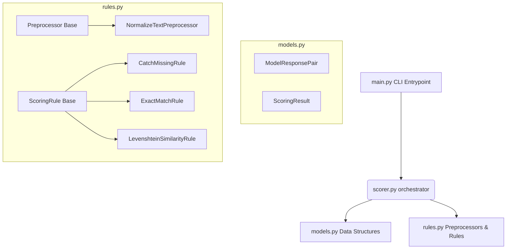

# Score CLI Tool

An extensible and modular Python application designed to grade AI model response pairs against ground-truth reference answers using configurable text pre-processors and scoring rules.

---

## Architecture & Implementation Details

The project has been refactored into modular components, isolating data structures, evaluation rules, pipeline orchestration, and execution logic:



### 1. Data Models (`src/models.py`)
- **`ModelResponsePair`**: Represents the input evaluation unit, containing properties such as `id` (automatically cast to an integer), `prompt`, `reference_answer`, and `model_answer`.
- **`ScoringResult`**: A tuple-subclass representing the outcome of evaluation. It contains `id`, `satisfied` (boolean match indicator), `score` (float score), and `reason` (detailed description of the match). Includes a `.json()` method for serialization.

### 2. Pre-processors & Rules (`src/rules.py`)
- **`Preprocessor`**: Abstract base class defining the contract for text cleaning or data transformation steps (e.g. `NormalizeTextPreprocessor` which strips whitespace and lowercases comparison values).
- **`ScoringRule`**: Abstract base class defining the contract for scoring logic.
  - **`CatchMissingRule`**: Flags records that have missing references or model answers (sets score to `0.0`).
  - **`ExactMatchRule`**: Evaluates true exact matches (sets score to `1.0`).
  - **`LevenshteinSimilarityRule`**: Fallback fuzzy matching rule returning a normalized similarity score (`1.0 - distance / max_length`) with a `"Partial match"` reasoning.

### 3. Orchestration (`src/scorer.py`)
- **`Score`**: Aggregates configured rules and pre-processors. It executes all pre-processors first, runs the scoring rules sequentially until a rule is satisfied, and collects summary statistics (`avg_score`, `no_items`, `no_exact`, `no_failed`).

---

## Implementation Tradeoffs

### 1. Increased Boilerplate vs. Extensibility
Decoupling logic into distinct `models.py`, `rules.py`, and `scorer.py` files introduces additional boilerplate (e.g. abstract classes, formal constructors, and explicit type conversion) compared to a single-file implementation. This upfront cost guarantees standard interfaces and clean team collaboration for future rule additions.

### 2. Mutability in Pre-processors
Pre-processors mutate the properties of `ModelResponsePair` in-place (e.g., lowercase conversion, trimming whitespace) before scoring rules run. While memory-efficient and simple, it means the original raw values are overwritten. If preserving raw casing is necessary for future rules, a deep-copy or secondary raw-field tracking strategy will be needed.

### 3. Sequential Evaluation (First-Satisfied Rule)
The orchestration engine runs rules sequentially and stops at the first satisfied rule. This avoids conflicts (e.g., an exact match returning a Levenshtein score) and speeds up execution, but prevents calculating multiple simultaneous alternative metrics for the same response pair.

---

## Future Improvements

### 1. Parallel and Async Pipeline Execution
To support large-scale validation sets containing thousands of items, we can parallelize the `Score.score()` calls using Python's `ProcessPoolExecutor` or make the endpoints asynchronous using Python's `asyncio` loop.

### 2. Configuration-Driven Pipelines
Allow users to define pre-processing steps and rule pipelines in a YAML/JSON configuration file (e.g., disabling normalization or altering the Levenshtein fallback criteria) without needing to alter python code directly.

### 3. Rich Diagnostics Metadata
Add an optional `metadata: dict` attribute to `ScoringResult` to return diagnostic metrics alongside the final score (e.g., the computed Levenshtein edit distance, matched regex groups, or execution latency).

### 4. Advanced Semantic Scoring Rules
Implement rules using semantic similarity models (such as `sentence-transformers`) to check if model outputs carry the same meaning as references, even if the phrasing differs completely.

---

## JSON Output Schema

The program outputs a combined JSON document to standard output with the following schema:

```json
{
    "results": [
        {
            "id": 1,
            "score": 1.0,
            "reason": "Exact match"
        },
        {
            "id": 2,
            "score": 0.0,
            "reason": "Model answer is missing"
        },
        {
            "id": 3,
            "score": 0.5714285714285714,
            "reason": "Partial match"
        }
    ],
    "summary": {
        "avg_score": 0.5238095238095238,
        "no_items": 3,
        "no_exact": 1,
        "no_failed": 1
    }
}
```

---

## Usage

### Prerequisites
Make sure you have Python and all required dependencies installed:
```bash
pip install Levenshtein fastapi uvicorn httpx
```

### Running the Scorer CLI
To execute the scorer against an input JSON file containing response pairs:
```bash
python src/main.py path/to/input.json
```

### Running the FastAPI API Server
You can launch the web API server locally:
```bash
uvicorn src.app:app --host 127.0.0.1 --port 8000 --reload
```

Once running, send a `POST` request to `/score` with the response pairs payload:
```bash
curl -X POST "http://127.0.0.1:8000/score" \
     -H "Content-Type: application/json" \
     -d '[
           {"id": 1, "prompt": "Q1", "reference_answer": "  Apple  ", "model_answer": "apple"},
           {"id": 2, "prompt": "Q2", "reference_answer": "banana", "model_answer": ""}
         ]'
```

### Running the Test Suite
To run the full test suite (covering unit tests, CLI integration, and API tests):
```bash
python -m unittest discover tests
```