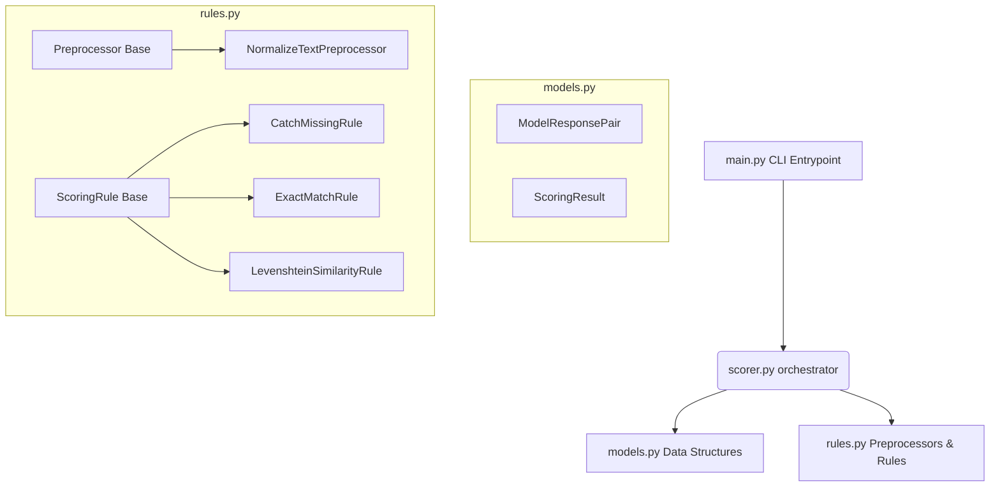

# Score CLI Tool

An extensible and modular Python application designed to grade AI model response pairs against ground-truth reference answers using configurable text pre-processors and scoring rules.

---

## Architecture & Implementation Details

The project has been refactored into modular components, isolating data structures, evaluation rules, pipeline orchestration, and execution logic:



### 1. Data Models (`src/models.py`)
- **`ModelResponsePair`**: Represents the input evaluation unit, containing properties such as `id` (automatically cast to an integer), `prompt`, `reference_answer`, and `model_answer`.
- **`ScoringResult`**: A tuple-subclass representing the outcome of evaluation. It contains `id`, `satisfied` (boolean match indicator), `score` (float score), and `reason` (detailed description of the match). Includes a `.json()` method for serialization.

### 2. Pre-processors & Rules (`src/rules.py`)
- **`Preprocessor`**: Abstract base class defining the contract for text cleaning or data transformation steps (e.g. `NormalizeTextPreprocessor` which strips whitespace and lowercases comparison values).
- **`ScoringRule`**: Abstract base class defining the contract for scoring logic.
  - **`CatchMissingRule`**: Flags records that have missing references or model answers (sets score to `0.0`).
  - **`ExactMatchRule`**: Evaluates true exact matches (sets score to `1.0`).
  - **`LevenshteinSimilarityRule`**: Fallback fuzzy matching rule returning a normalized similarity score (`1.0 - distance / max_length`) with a `"Partial match"` reasoning.

### 3. Orchestration (`src/scorer.py`)
- **`Score`**: Aggregates configured rules and pre-processors. It executes all pre-processors first, runs the scoring rules sequentially until a rule is satisfied, and collects summary statistics (`avg_score`, `no_items`, `no_exact`, `no_failed`).

### Implementation Tradeoffs

1. Increased Boilerplate, especially for matching and preprocessing rules


### Future Improvements

1. Parallel Execution of scoring

---

## JSON Output Schema

The program outputs a combined JSON document to standard output with the following schema:

```json
{
    "results": [
        {
            "id": 1,
            "score": 1.0,
            "reason": "Exact match"
        },
        {
            "id": 2,
            "score": 0.0,
            "reason": "Model answer is missing"
        },
        {
            "id": 3,
            "score": 0.5714285714285714,
            "reason": "Partial match"
        }
    ],
    "summary": {
        "avg_score": 0.5238095238095238,
        "no_items": 3,
        "no_exact": 1,
        "no_failed": 1
    }
}
```

---

## Usage

### Prerequisites
Make sure you have python and the `Levenshtein` library installed:
```bash
pip install Levenshtein
```

### Running the Scorer
To execute the scorer against an input JSON file containing response pairs:
```bash
python src/main.py path/to/input.json
```

### Running the Test Suite
A comprehensive test suite containing unit tests and subprocess-based integration tests is located in the `tests/` directory:
```bash
python -m unittest tests/test_scorer.py
```